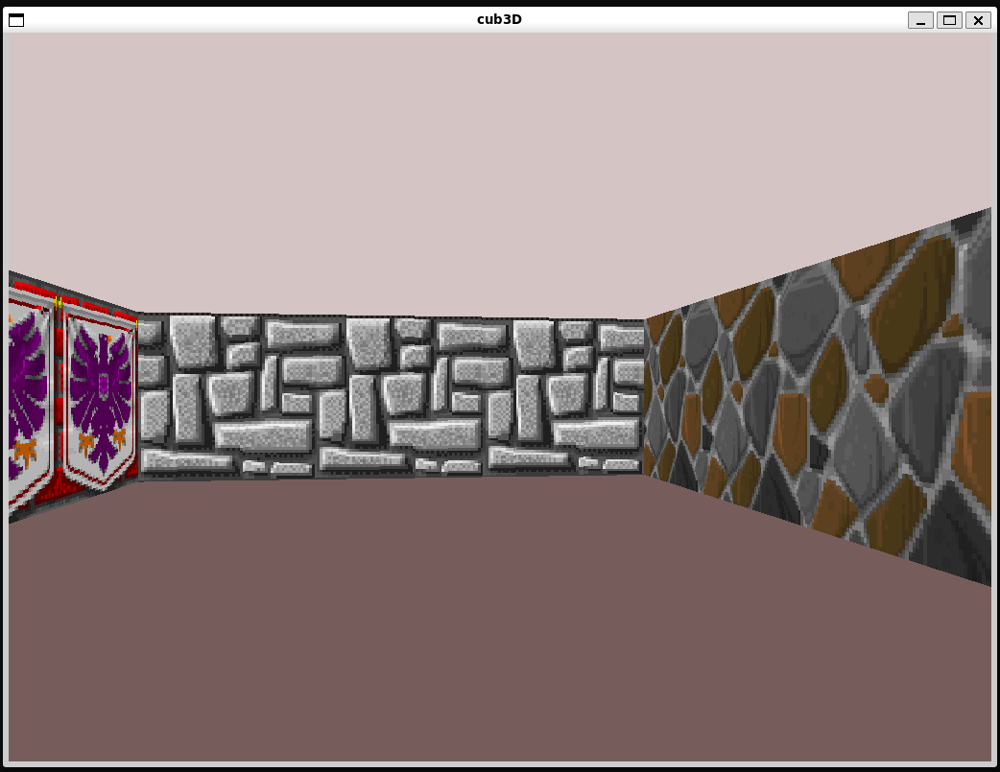

# cub3D

A first-person 3D raycasting engine written in C using the MiniLibX graphical library, inspired by the architecture of id Software's *Wolfenstein 3D*. The project translates a 2D grid map into a perspective-correct 3D projection in real time through geometric raycasting, DDA (Digital Differential Analysis) grid traversal, texture mapping, and deterministic collision bounding.

---

## 📌 Technical Scope & Subject Requirements

* **Execution Interface**: `./cub3D <scene_file.cub>`.
* **Scene Configuration (`.cub` file)**:

  * Strict parsing of asset paths for directional textures: North (`NO`), South (`SO`), West (`WE`), East (`EA`).
  * Floor (`F`) and ceiling (`C`) color definitions formatted as comma-separated RGB triplets in the valid $[0, 255]$ range.
  * Grid characters: walkable space (`0`), solid wall (`1`), and a single player spawn point with an initial orientation (`N`, `S`, `E`, or `W`).
  * The map must be fully enclosed by solid walls (`1`); missing boundaries or invalid formatting must cause the engine to exit cleanly with `Error\n` followed by an explicit diagnostic message.
* **Rendering & Controls**:

  * Real-time projection rendering inside a native X11 window using MiniLibX image buffers.
  * Directional translation (`W`, `A`, `S`, `D`) and angular camera rotation (Left / Right arrow keys).
  * Clean window and resource teardown on `ESC` keypress or native window close button (`DestroyNotify`).
* **Bonus Implementation (Collision Detection)**:

  * **Wall Collision Prevention**: Positional updates evaluate player velocity vectors against map boundary cells with an operational collision margin, preventing the camera from entering or clipping into solid walls (`1`).
* **Authorized Library Primitives**: `open`, `close`, `read`, `write`, `printf`, `malloc`, `free`, `perror`, `strerror`, `exit`, `gettimeofday`, math library (`-lm`), and MiniLibX graphics routines.

---

## 📐 Architecture & Key Engineering Concepts

### 1. Raycasting Pipeline & DDA Algorithm

Rather than computing full 3D polygon meshes, the engine projects 2D grids onto the screen column by column ($x = 0 \to \text{width} - 1$):

```text
   [ Player Position (px, py) + Camera Plane ]
                        │
                        ▼
          Calculate Ray Vector per Screen Column
                        │
                        ▼
       Digital Differential Analysis (DDA Loop)
       - Step through 2D grid squares (mapX, mapY)
       - Identify wall hit coordinate & orientation (N/S/E/W)
                        │
                        ▼
     Compute Perpendicular Wall Distance (Avoid Fisheye)
                        │
                        ▼
         Calculate Projected Slice Height on Screen
                        │
                        ▼
  Sample Texture Offset (TexX, TexY) & Render to Buffer
```

* **Digital Differential Analysis (DDA)**: Steps through discrete integer grid coordinates along the ray trajectory in $O(\text{distance})$ time, identifying exact surface intersections with zero floating-point drift.
* **Perpendicular Distance Projection**: Normalizes Euclidean ray length against the camera viewing vector to eliminate the standard wide-angle distortion (fisheye effect).
* **Texture Sampling**: Maps the hit offset to corresponding wall surface textures (North, South, East, West) and renders individual pixels directly to an off-screen image buffer using raw byte strides.

### 2. Kinematics & Bounding Box Collisions

Player position is updated continuously using 2D vector kinematics:

\(\vec{P}_{\text{new}} = \vec{P}_{\text{current}} + \vec{D} \cdot v \cdot \Delta t\)

* **Sliding & Collision Padding**: The collision system decouples horizontal ($x$) and vertical ($y$) motion vectors. If a proposed movement step infringes upon a wall tile or falls within a configured boundary margin, the infringing axis is zeroed while permitting tangential movement along the unobstructed axis.

---

## 🛠️ Build & Usage

### Prerequisites

* Linux environment with X11 development headers (`libx11-dev`, `libxext-dev`, `libbsd-dev`).
* Standard C toolchain (`gcc`/`clang`, `make`).

### Compilation

```bash
make
```

### Execution

```bash
# Launch engine with a valid scene configuration
./cub3D maps/valid_scene.cub

# Parsing failure verification
./cub3D maps/invalid_open_map.cub
```

### Examples:



## 🎯 Target Relevance: C/C++ Systems & Industrial Software

* **Low-Level Software Rendering & Frame Buffering**: Direct manipulation of frame buffers and raw pixel memory strides (`bits_per_pixel`, `line_size`, `endianness`) mirroring display pipeline drivers, embedded graphical instrumentation, and industrial HMI displays.
* **Discrete Grid Traversal & Spatial Mathematics**: Practical application of linear algebra, vector projections, and ray-intersection algorithms (DDA) directly transferable to LiDAR sensor processing, AGV (Automated Guided Vehicle) indoor pathing, and machine vision systems.
* **Predictable Execution & Deterministic Safety**: Continuous rendering cycles operating with zero memory leaks (`valgrind` clean) and defensive map validation routines guarding against malformed external input data.

## Collaborators:
- [JotaEmeDiaz](https://github.com/JotaEmeDiaz)
- [KarmaFaber](https://github.com/KarmaFaber)

## 📚 Resources & Integrity

* **Geometric Specifications**: Implementation built following Lode Vandevenne's standard raycasting formulations and Wolfenstein 3D architectural mechanics.
* **AI Tool Disclosure**: AI tools were utilized to verify trigonometric edge cases (such as camera vector zero-division guards and coordinate normalization across quadrant boundaries). Scene parser architecture, rendering math, collision routines, and system resource hooks were authored and validated directly.
