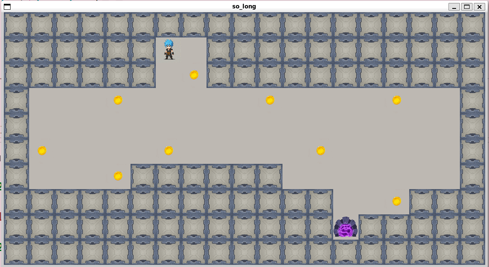
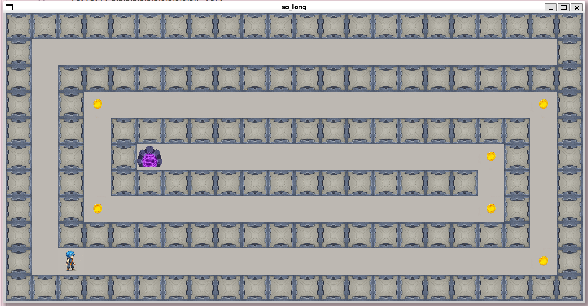
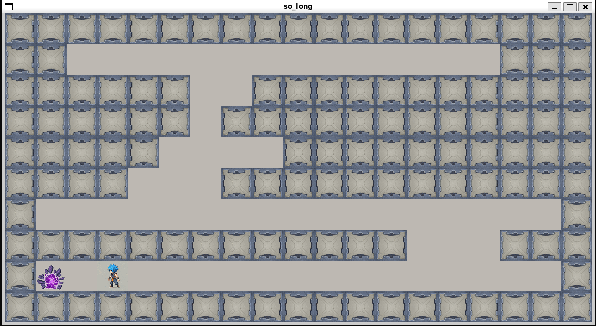

# so_long

A 2D top-down game engine written in C using MiniLibX (X11 wrapper). The project emphasizes event-driven programming, 2D matrix parsing, spatial pathfinding validation (flood fill), and deterministic graphic lifecycle management.

---

## 📌 Technical Scope & Subject Requirements

* **Execution Interface**: `./so_long <map_file.ber>`.
* **Input Specifications (`.ber` format)**:

  * Must be fully enclosed by outer walls (`1`).
  * Strictly rectangular geometry with consistent line lengths.
  * Contains exactly 1 player start (`P`), 1 exit (`E`), and at least 1 collectible (`C`) across walkable tiles (`0`).
  * Invalid characters, duplicate starts/exits, or open boundaries trigger an explicit `Error\n` message and a clean exit.
* **Gameplay & Rendering**:

  * Movement controls via standard keys (`W`, `A`, `S`, `D` or arrow keys) preventing wall penetration.
  * Move counter rendered to `stdout` upon every discrete player translation.
  * Collection of all items (`C`) is mandatory before enabling the exit trigger (`E`).
* **Window Lifecycle**:

  * Persistent rendering handling focus changes and window minimize events.
  * Clean exit and memory teardown triggered by the `ESC` key or native window close button (`DestroyNotify` / X11 close button).
* **Authorized Primitives**: `open`, `close`, `read`, `write`, `malloc`, `free`, `perror`, `strerror`, `exit`, `gettimeofday`, math library (`-lm`), and MiniLibX functions.

---

## 📐 Architecture & Key Engineering Concepts

### 1. State Machine & Event Dispatch Loop

The application runs on top of the MiniLibX event framework, maintaining a central runtime context (`t_game` state struct):

```text
   [ Read .ber Map ] ---> [ Semantic & Boundary Validation ]
                                      |
                                      v
                          [ Flood Fill Path Verification ]
                                      |
                                      v
                          [ Initialize MLX & Window ]
                                      |
                                      v
                         +---> [ Event Hook Loop ] <---+
                         |     - Keypress (W/A/S/D/ESC)|
                         |     - Window Close (Cross)  |
                         |               |             |
                         |               v             |
                         |     [ State Update & Logic ]|
                         |     - Collision Detection   |
                         |     - Collectible Counter   |
                         |               |             |
                         |               v             |
                         +---- [ Redraw Frame Buffer ] +
```

### 2. Pathfinding Validation (Flood Fill)

Before allocating any display server resources or window contexts, map playability is verified using a recursive flood-fill algorithm:

* Traverses all reachable coordinates starting from `P` across adjacent free tiles (`0`, `C`, `E`).
* Ensures a viable path exists to collect all `C` tokens and exit through `E`.
* Rejects unreachable layouts, avoiding execution of structurally unsolvable game states.

### 3. Resource & Memory Safety

* **Deterministic Teardown**: Systematically frees loaded image buffers (`mlx_destroy_image`), window instances (`mlx_destroy_window`), the display connection (`mlx_destroy_display`), and the dynamically allocated map matrix.
* **Zero Leak Policy**: Validated with `valgrind` across both normal completions and early error exits triggered by corrupted map files.

---

## 🛠️ Build & Usage

### Prerequisites

* Linux environment with X11 development headers (`libx11-dev`, `libxext-dev`, `libbsd-dev`).

bash
```
sudo apt update && sudo apt install -y libx11-dev libxext-dev libbsd-dev zlib1g-dev
```

* Standard C toolchain (`gcc`/`clang`, `make`).

### Compilation

```bash
make
```

### Execution

Bash

```bash
# Valid map run
./so_long map_9_valid.ber

# Testing invalid configuration handling
./so_long map_1_wals_invalid.ber
```

### Examples










## 🎯 Target Relevance: C/C++ Systems & Industrial Software

* **Embedded GUI & Event-Driven Patterns**: Direct experience structuring non-blocking event loops, keyboard hook interrupts, and frame buffer rendering applicable to industrial HMIs (Human-Machine Interfaces) and graphical diagnostic tools.
* **Defensive Matrix Parsing**: Implementation of rigorous byte-by-byte boundary checks, state machine validation, and matrix manipulation preventing buffer overflows during untrusted file ingestion.
* **Deterministic Resource Teardown**: Strict encapsulation of hardware-adjacent abstractions (display contexts, image pointers) ensuring clean recovery during abnormal system interrupts.
